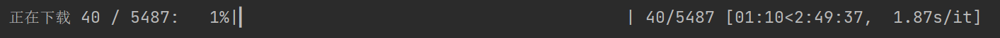
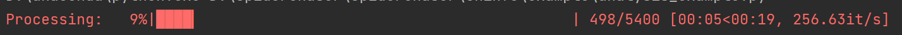
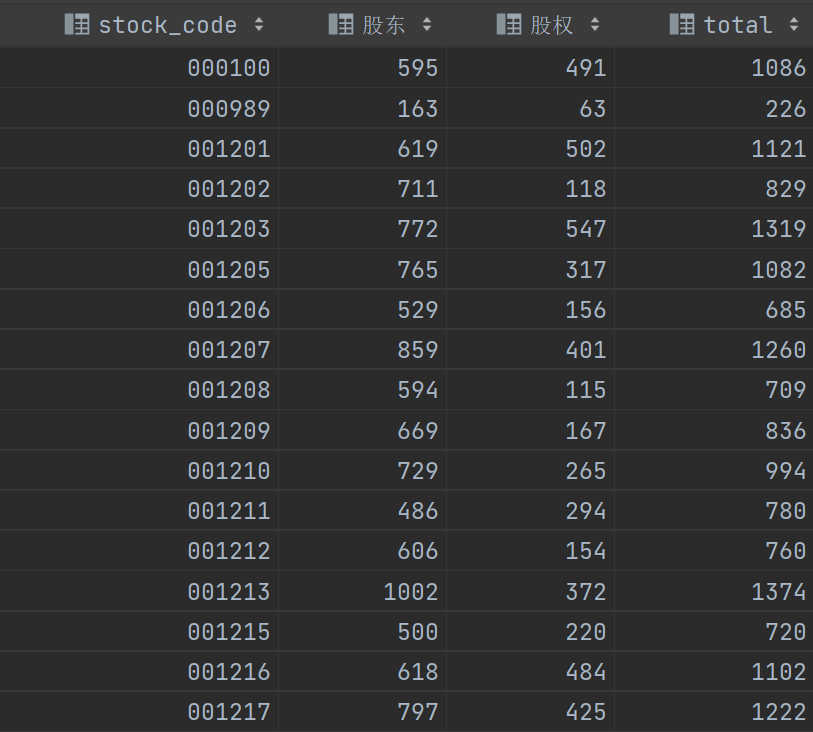
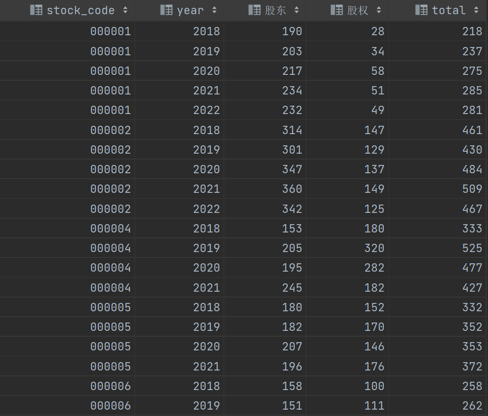

# SpiderChaser
此项目下所有爬虫仅供学习交流，不承担任何法律责任，如有侵权，请联系作者删除  

**如果本项目中的爬虫对你有帮助，给我点上一个小星星:star2:吧！你们的星星是我持续更新的动力！**

---

## 巨潮资讯网(http://www.cninfo.com.cn)
主要包含两个功能：
- 报告下载
- 报告分析  


**报告下载**采用异步的方式(aiohttp)来并发下载报告，具体流程建议阅读代码，这里不做进一步解释

报告下载示例代码
```python
from report_downloader import ReportDownloader
downloader = ReportDownloader()
downloader.download()
```

报告下载运行截图  


ReportDownloader类初始化参数:
参数|含义|可选项|默认
:--:|:--:|:--:|:--:|
category|报告类型|年度报告、半年度报告、三季度报告、一季度报告、招股说明书|年度报告
report_path|报告存储路径||当前目录

download方法可配置参数：  
参数|含义|可选项|默认
:--:|:--:|:--:|:--:|
start_year|起始年份||2012
end_year|结束年份||2022
file_type|下载文件类型|txt、pdf|txt
stock_codes|股票代码|A股、B股、all或自定义列表|A股
only_zip|仅保留压缩包|True、False|False
max_concurrency|最大并发量(协程)||20
excluded_keywords_in_title|排除含特定标题的报告||'修改', '取消', '摘要', '意见', '提示性', '概要','公告'


**报告分析**采用多进程的方式(multiprocessing)来对本地已保存的报告进行词频统计、情感分析(TODO)  

词频统计示例代码
```python
from report_analyzer import ReportAnalyzer
downloader = ReportAnalyzer(category='招股说明书',report_path=r'D:\爬虫数据\招股说明书')
downloader.count_keywords_frequency(keywords='股东')
```

词频统计运行截图  


招股说明书词频统计截图  


年度报告词频统计截图  


ReportAnalyzer类初始化参数:
参数|含义|可选项|默认
:--:|:--:|:--:|:--:|
category|报告类型|年度报告、半年度报告、三季度报告、一季度报告、招股说明书|年度报告
report_path|报告存储路径||当前目录

count_keywords_frequency方法可配置参数：
参数|含义|可选项|默认
:--:|:--:|:--:|:--:|
keywords|关键词|str、list|
start_year|起始年份||2012
end_year|结束年份||2022
stock_codes|股票代码|A股、B股、all或自定义列表|A股
save_type|分析结果文件类型|csv|csv
save_name|分析结果文件名||result
max_concurrency|最大并发量(进程)||当前cpu核数
traditional|开启繁体|True、False|False


